# User Flow (사용자 흐름도): PolicyFlow KR

> 정책 캘린더 서비스의 핵심 사용자 여정

---

## MVP 캡슐

| # | 항목 | 내용 |
|---|------|------|
| 1 | 목표 | 모든 국민이 자신에게 해당하는 정책 자금을 단 1원도 놓치지 않도록 돕는다 |
| 2 | 페르소나 | 취업준비생 김민수(26세), 소상공인 이영희(45세) |
| 3 | 핵심 기능 | FEAT-1: 정책 캘린더 (맞춤형 정책 시각화) |
| 4 | 성공 지표 (노스스타) | MAU 10,000명 |
| 5 | 입력 지표 | 북마크 정책 수, 푸시 알림 허용률 |
| 6 | 비기능 요구 | 서버 비용 0원 (Cloudflare 무료 티어) |
| 7 | Out-of-scope | 다크모드, 모바일 앱, 정책 신청 대행 |
| 8 | Top 리스크 | 공공 API 변경/중단 시 데이터 수집 불가 |
| 9 | 완화/실험 | Health Check Worker + 사용자 제보 시스템 |
| 10 | 다음 단계 | Cloudflare 계정 세팅 및 D1 데이터베이스 생성 |

---

## 1. 전체 사용자 여정 (Overview)

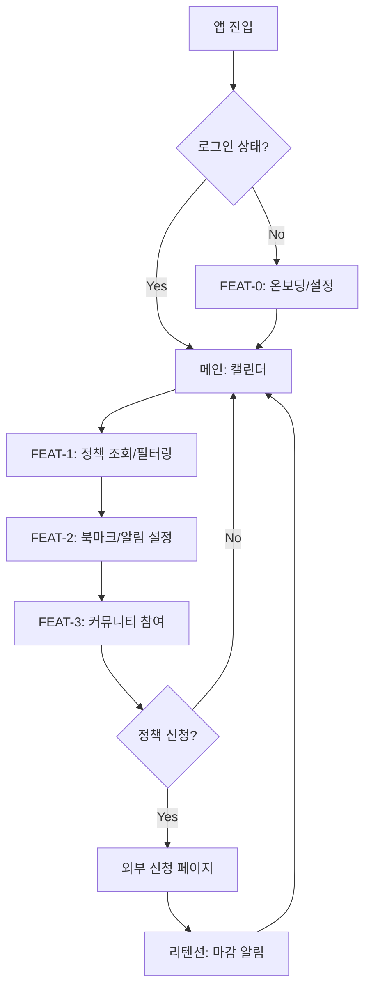

---

## 2. FEAT-0: 온보딩/설정 플로우

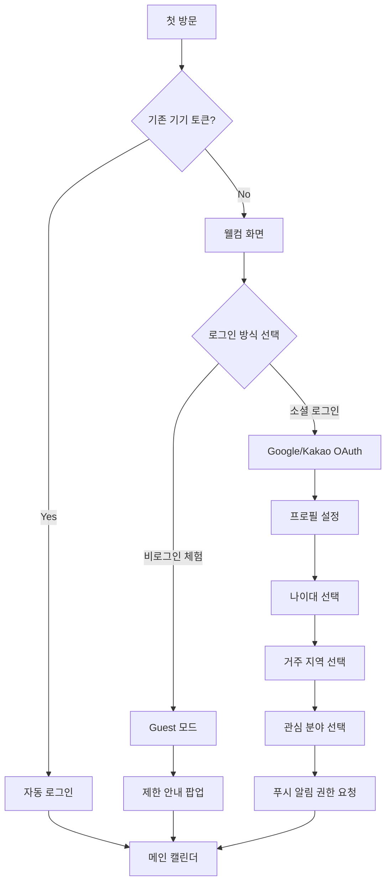

---

## 3. FEAT-1: 정책 캘린더 플로우

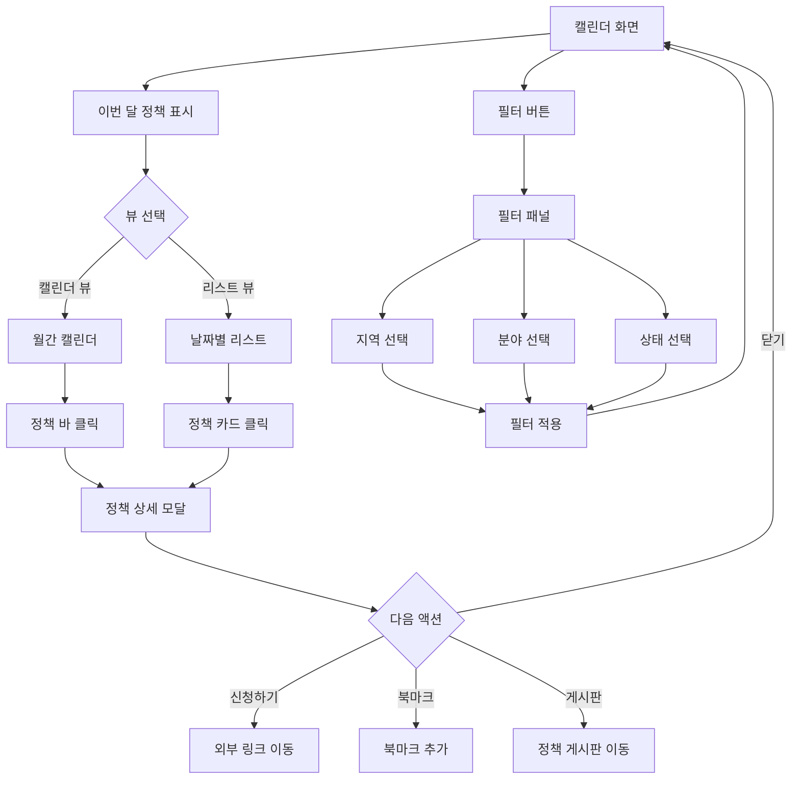

### 3.1 정책 상세 모달 구조

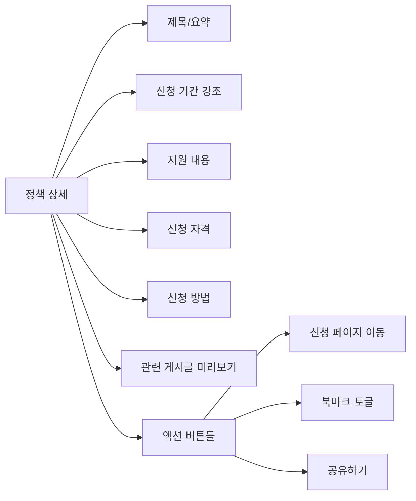

---

## 4. FEAT-2: 북마크 & 알림 플로우

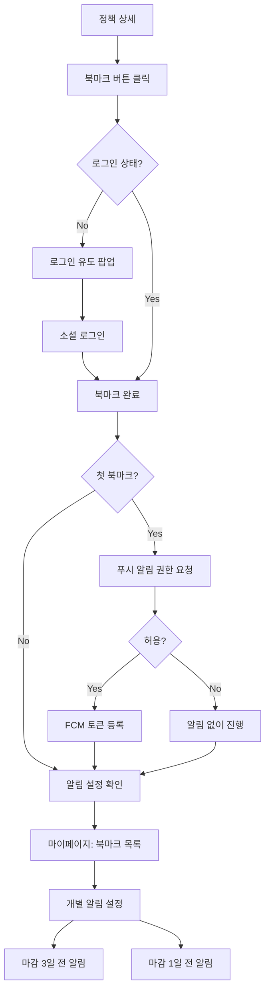

### 4.1 푸시 알림 수신 플로우

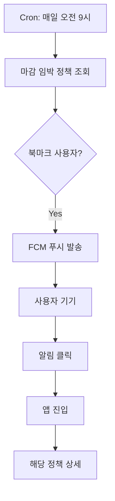

---

## 5. FEAT-3: 커뮤니티 게시판 플로우

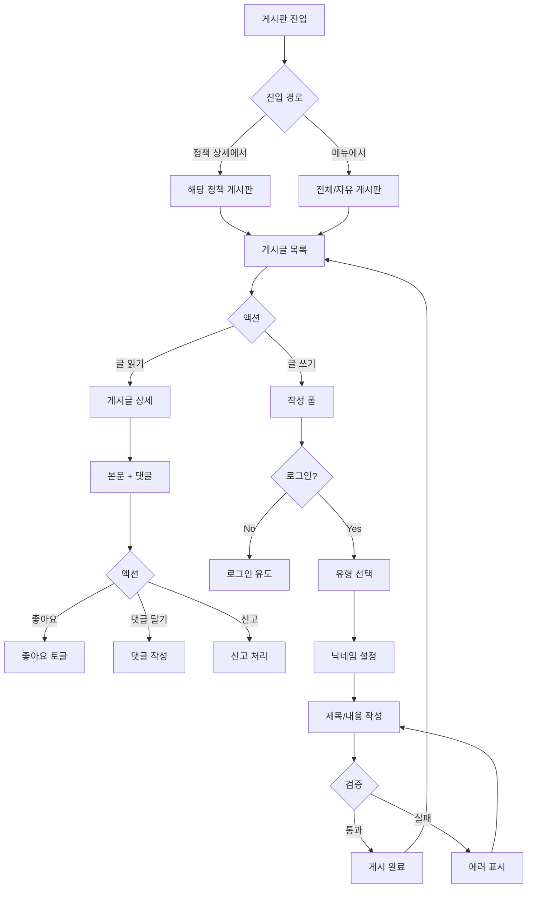

### 5.1 댓글/대댓글 플로우

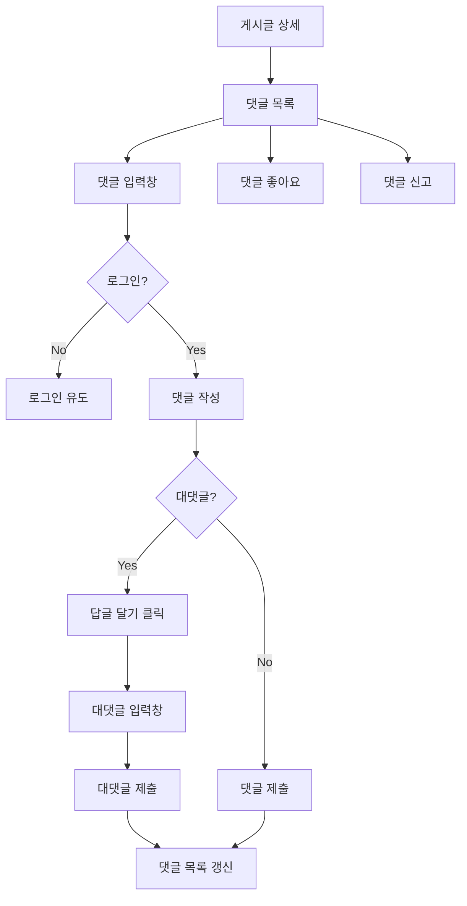

---

## 6. 리텐션 루프 (습관 형성)

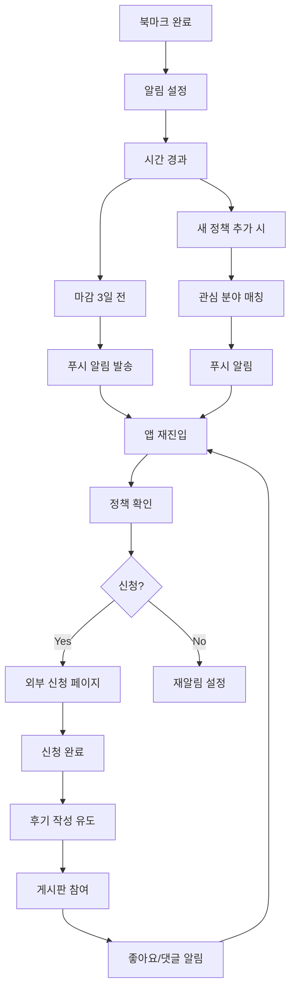

---

## 7. 에러 처리 플로우

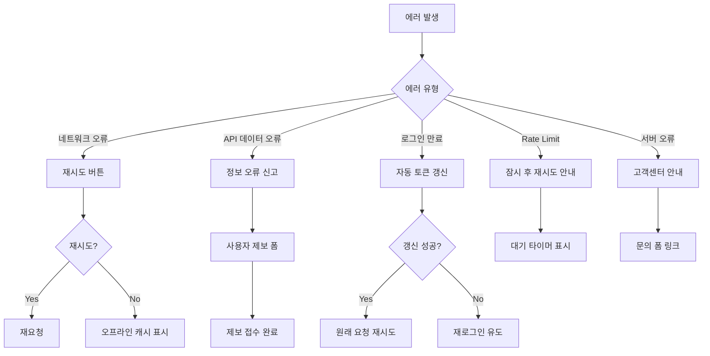

---

## 8. 화면 목록 (Screen Inventory)

| 화면 ID | 화면명 | FEAT | 진입점 | 주요 액션 |
|---------|--------|------|--------|----------|
| S-01 | 웰컴 화면 | FEAT-0 | 첫 방문 | 로그인 방식 선택 |
| S-02 | 소셜 로그인 | FEAT-0 | S-01 | Google/Kakao 인증 |
| S-03 | 프로필 설정 | FEAT-0 | S-02 | 나이/지역/관심분야 설정 |
| S-04 | 메인 캘린더 | FEAT-1 | S-03, 자동로그인 | 정책 조회, 필터링 |
| S-05 | 정책 상세 모달 | FEAT-1 | S-04 | 상세 확인, 북마크, 신청 이동 |
| S-06 | 필터 패널 | FEAT-1 | S-04 | 지역/분야/상태 필터 |
| S-07 | 마이페이지 | FEAT-2 | 하단 탭 | 설정, 북마크 관리 |
| S-08 | 북마크 목록 | FEAT-2 | S-07 | 북마크 확인, 알림 설정 |
| S-09 | 게시판 목록 | FEAT-3 | 하단 탭, S-05 | 게시글 조회 |
| S-10 | 게시글 상세 | FEAT-3 | S-09 | 읽기, 댓글, 좋아요 |
| S-11 | 게시글 작성 | FEAT-3 | S-09 | 글 작성 |
| S-12 | 푸시 알림 설정 | FEAT-2 | S-07 | 알림 on/off |

---

## 9. 네비게이션 구조

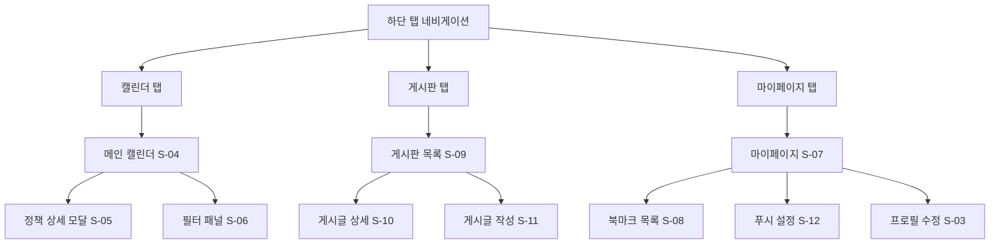

---

## Decision Log

| # | 결정 | 이유 |
|---|------|------|
| 1 | 하단 탭 3개 (캘린더/게시판/마이페이지) | 모바일 친화적, 핵심 기능 빠른 접근 |
| 2 | 정책 상세는 모달로 | 컨텍스트 유지, 빠른 닫기 |
| 3 | 첫 북마크 시 푸시 권한 요청 | 적절한 타이밍, 가치 인지 후 요청 |
| 4 | Guest 모드 허용 | 진입 장벽 낮춤, 기능 체험 후 전환 유도 |
