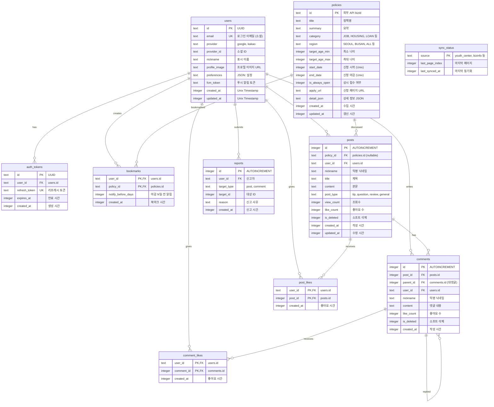

# Database Design (데이터베이스 설계): PolicyFlow KR

> Cloudflare D1 (SQLite) 기반 데이터베이스 스키마

---

## MVP 캡슐

| # | 항목 | 내용 |
|---|------|------|
| 1 | 목표 | 모든 국민이 자신에게 해당하는 정책 자금을 단 1원도 놓치지 않도록 돕는다 |
| 2 | 페르소나 | 취업준비생 김민수(26세), 소상공인 이영희(45세) |
| 3 | 핵심 기능 | FEAT-1: 정책 캘린더 (맞춤형 정책 시각화) |
| 4 | 성공 지표 (노스스타) | MAU 10,000명 |
| 5 | 입력 지표 | 북마크 정책 수, 푸시 알림 허용률 |
| 6 | 비기능 요구 | 서버 비용 0원 (Cloudflare 무료 티어, D1 500MB) |
| 7 | Out-of-scope | 다크모드, 모바일 앱, 정책 신청 대행 |
| 8 | Top 리스크 | 공공 API 변경/중단 시 데이터 수집 불가 |
| 9 | 완화/실험 | Health Check Worker + 사용자 제보 시스템 |
| 10 | 다음 단계 | Cloudflare 계정 세팅 및 D1 데이터베이스 생성 |

---

## 1. ERD (Entity Relationship Diagram)



---

## 2. 엔티티 상세 정의

### 2.1 users (사용자) - FEAT-0

| 컬럼 | 타입 | 제약조건 | 설명 |
|------|------|----------|------|
| id | TEXT | PK | UUID v4 |
| email | TEXT | UNIQUE, NULL 허용 | 소셜 로그인 이메일 |
| provider | TEXT | NOT NULL | 'google', 'kakao' |
| provider_id | TEXT | NOT NULL | 소셜 서비스 고유 ID |
| nickname | TEXT | NOT NULL | 표시 이름 (기본: 익명) |
| profile_image | TEXT | NULL | 프로필 이미지 URL |
| preferences | TEXT | NULL | JSON: { regions: [], categories: [], ageRange: {} } |
| fcm_token | TEXT | NULL | Firebase Cloud Messaging 토큰 |
| created_at | INTEGER | NOT NULL | Unix Timestamp |
| updated_at | INTEGER | NOT NULL | Unix Timestamp |

**인덱스:**
```sql
CREATE UNIQUE INDEX idx_users_provider ON users(provider, provider_id);
CREATE INDEX idx_users_email ON users(email);
```

**최소 수집 원칙 적용:**
- 필수: provider, provider_id
- 선택: email, nickname, profile_image
- 수집 안 함: 주민번호, 실명, 전화번호, 상세 주소

**preferences JSON 구조:**
```json
{
  "regions": ["SEOUL", "GYEONGGI"],
  "categories": ["JOB", "HOUSING"],
  "ageRange": { "min": 20, "max": 35 },
  "notifyBeforeDays": [3, 1]
}
```

### 2.2 auth_tokens (인증 토큰) - FEAT-0

| 컬럼 | 타입 | 제약조건 | 설명 |
|------|------|----------|------|
| id | TEXT | PK | UUID v4 |
| user_id | TEXT | FK → users.id, NOT NULL | 사용자 참조 |
| refresh_token | TEXT | UNIQUE, NOT NULL | 리프레시 토큰 |
| expires_at | INTEGER | NOT NULL | 만료 Unix Timestamp |
| created_at | INTEGER | NOT NULL | 생성 시간 |

**인덱스:**
```sql
CREATE INDEX idx_auth_tokens_user ON auth_tokens(user_id);
CREATE INDEX idx_auth_tokens_expires ON auth_tokens(expires_at);
```

### 2.3 policies (정책) - FEAT-1

| 컬럼 | 타입 | 제약조건 | 설명 |
|------|------|----------|------|
| id | TEXT | PK | 외부 API bizId (R2023011234 형식) |
| title | TEXT | NOT NULL | 정책명 |
| summary | TEXT | NULL | 요약 (200자 이내) |
| category | TEXT | NOT NULL | 분류: JOB, HOUSING, LOAN, EDUCATION, STARTUP |
| region | TEXT | NOT NULL | 지역: SEOUL, BUSAN, ... , ALL |
| target_age_min | INTEGER | NULL | 대상 최소 나이 |
| target_age_max | INTEGER | NULL | 대상 최대 나이 |
| start_date | INTEGER | NULL | 신청 시작 Unix Timestamp |
| end_date | INTEGER | NULL | 신청 마감 Unix Timestamp |
| is_always_open | INTEGER | DEFAULT 0 | 상시 접수 여부 (1=true) |
| apply_url | TEXT | NULL | 신청 페이지 URL |
| detail_json | TEXT | NULL | 상세 정보 JSON (압축) |
| created_at | INTEGER | NOT NULL | 최초 수집 시간 |
| updated_at | INTEGER | NOT NULL | 마지막 갱신 시간 |

**인덱스:**
```sql
CREATE INDEX idx_policies_filter ON policies(region, category);
CREATE INDEX idx_policies_date ON policies(start_date, end_date);
CREATE INDEX idx_policies_updated ON policies(updated_at DESC);
```

**detail_json 구조:**
```json
{
  "content_html": "<p>지원 내용...</p>",
  "eligibility": "만 19세~34세 청년",
  "documents": ["신분증", "재학증명서"],
  "contact": "02-1234-5678",
  "source_url": "https://youthcenter.go.kr/..."
}
```

**카테고리 ENUM:**
| 코드 | 설명 |
|------|------|
| JOB | 취업/창업 |
| HOUSING | 주거/생활 |
| LOAN | 금융/대출 |
| EDUCATION | 교육/장학 |
| STARTUP | 창업지원 |
| WELFARE | 복지/지원 |

**지역 ENUM:**
| 코드 | 설명 |
|------|------|
| ALL | 전국 |
| SEOUL | 서울 |
| BUSAN | 부산 |
| DAEGU | 대구 |
| INCHEON | 인천 |
| GWANGJU | 광주 |
| DAEJEON | 대전 |
| ULSAN | 울산 |
| SEJONG | 세종 |
| GYEONGGI | 경기 |
| GANGWON | 강원 |
| CHUNGBUK | 충북 |
| CHUNGNAM | 충남 |
| JEONBUK | 전북 |
| JEONNAM | 전남 |
| GYEONGBUK | 경북 |
| GYEONGNAM | 경남 |
| JEJU | 제주 |

### 2.4 bookmarks (북마크) - FEAT-2

| 컬럼 | 타입 | 제약조건 | 설명 |
|------|------|----------|------|
| user_id | TEXT | PK, FK → users.id | 사용자 |
| policy_id | TEXT | PK, FK → policies.id | 정책 |
| notify_before_days | INTEGER | DEFAULT 3 | 마감 N일 전 알림 |
| created_at | INTEGER | NOT NULL | 북마크 시간 |

**인덱스:**
```sql
CREATE INDEX idx_bookmarks_user ON bookmarks(user_id, created_at DESC);
CREATE INDEX idx_bookmarks_policy ON bookmarks(policy_id);
```

### 2.5 posts (게시글) - FEAT-3

| 컬럼 | 타입 | 제약조건 | 설명 |
|------|------|----------|------|
| id | INTEGER | PK AUTOINCREMENT | 자동 증가 ID |
| policy_id | TEXT | FK → policies.id, NULL | 연관 정책 (NULL=자유게시판) |
| user_id | TEXT | FK → users.id, NULL | 작성자 (탈퇴 시 NULL) |
| nickname | TEXT | NULL | 표시 닉네임 (NULL=익명#해시) |
| title | TEXT | NOT NULL | 제목 (50자 제한) |
| content | TEXT | NOT NULL | 본문 (2000자 제한) |
| post_type | TEXT | DEFAULT 'general' | 유형: tip, question, review, general |
| view_count | INTEGER | DEFAULT 0 | 조회수 |
| like_count | INTEGER | DEFAULT 0 | 좋아요 수 (캐싱) |
| is_deleted | INTEGER | DEFAULT 0 | 소프트 삭제 (1=삭제됨) |
| created_at | INTEGER | NOT NULL | 작성 시간 |
| updated_at | INTEGER | NULL | 수정 시간 |

**인덱스:**
```sql
CREATE INDEX idx_posts_policy ON posts(policy_id, created_at DESC);
CREATE INDEX idx_posts_type ON posts(post_type, created_at DESC);
CREATE INDEX idx_posts_user ON posts(user_id);
```

**post_type ENUM:**
| 코드 | 설명 | 태그 색상 |
|------|------|----------|
| tip | 꿀팁 | 초록 |
| question | 질문 | 파랑 |
| review | 후기 | 주황 |
| general | 일반 | 회색 |

### 2.6 comments (댓글) - FEAT-3

| 컬럼 | 타입 | 제약조건 | 설명 |
|------|------|----------|------|
| id | INTEGER | PK AUTOINCREMENT | 자동 증가 ID |
| post_id | INTEGER | FK → posts.id, NOT NULL | 부모 게시글 |
| parent_id | INTEGER | FK → comments.id, NULL | 대댓글 부모 (NULL=최상위) |
| user_id | TEXT | FK → users.id, NULL | 작성자 (탈퇴 시 NULL) |
| nickname | TEXT | NULL | 표시 닉네임 |
| content | TEXT | NOT NULL | 댓글 내용 (500자 제한) |
| like_count | INTEGER | DEFAULT 0 | 좋아요 수 |
| is_deleted | INTEGER | DEFAULT 0 | 소프트 삭제 |
| created_at | INTEGER | NOT NULL | 작성 시간 |

**인덱스:**
```sql
CREATE INDEX idx_comments_post ON comments(post_id, created_at);
CREATE INDEX idx_comments_parent ON comments(parent_id);
```

### 2.7 post_likes / comment_likes (좋아요) - FEAT-3

**post_likes:**
| 컬럼 | 타입 | 제약조건 | 설명 |
|------|------|----------|------|
| user_id | TEXT | PK, FK → users.id | 좋아요 누른 사용자 |
| post_id | INTEGER | PK, FK → posts.id | 대상 게시글 |
| created_at | INTEGER | NOT NULL | 좋아요 시간 |

**comment_likes:**
| 컬럼 | 타입 | 제약조건 | 설명 |
|------|------|----------|------|
| user_id | TEXT | PK, FK → users.id | 좋아요 누른 사용자 |
| comment_id | INTEGER | PK, FK → comments.id | 대상 댓글 |
| created_at | INTEGER | NOT NULL | 좋아요 시간 |

### 2.8 reports (신고) - FEAT-3

| 컬럼 | 타입 | 제약조건 | 설명 |
|------|------|----------|------|
| id | INTEGER | PK AUTOINCREMENT | 자동 증가 ID |
| user_id | TEXT | FK → users.id, NOT NULL | 신고자 |
| target_type | TEXT | NOT NULL | 'post' 또는 'comment' |
| target_id | INTEGER | NOT NULL | 대상 ID |
| reason | TEXT | NOT NULL | 신고 사유 |
| created_at | INTEGER | NOT NULL | 신고 시간 |

**인덱스:**
```sql
CREATE INDEX idx_reports_target ON reports(target_type, target_id);
```

### 2.9 sync_status (동기화 상태) - 내부 관리

| 컬럼 | 타입 | 제약조건 | 설명 |
|------|------|----------|------|
| source | TEXT | PK | 데이터 소스 (youth_center, bizinfo) |
| last_page_index | INTEGER | DEFAULT 0 | 마지막 처리 페이지 |
| last_synced_at | INTEGER | NOT NULL | 마지막 동기화 시간 |

---

## 3. 관계 정의

| 부모 | 자식 | 관계 | 설명 |
|------|------|------|------|
| users | auth_tokens | 1:N | 사용자는 여러 세션(토큰) 보유 가능 |
| users | bookmarks | 1:N | 사용자는 여러 정책 북마크 |
| users | posts | 1:N | 사용자는 여러 게시글 작성 |
| users | comments | 1:N | 사용자는 여러 댓글 작성 |
| policies | bookmarks | 1:N | 정책은 여러 사용자에게 북마크됨 |
| policies | posts | 1:N | 정책은 여러 게시글과 연관 |
| posts | comments | 1:N | 게시글은 여러 댓글 보유 |
| comments | comments | 1:N (자기참조) | 댓글은 대댓글 보유 |
| users + posts | post_likes | N:M | 다대다 관계 (중간 테이블) |
| users + comments | comment_likes | N:M | 다대다 관계 |

---

## 4. 데이터 생명주기

| 엔티티 | 생성 시점 | 보존 기간 | 삭제/익명화 |
|--------|----------|----------|------------|
| users | 소셜 로그인 | 탈퇴 요청 시까지 | 즉시 Hard Delete |
| auth_tokens | 로그인 | 만료 시 | 자동 Hard Delete |
| policies | Cron 수집 | 마감 후 1년 | 아카이빙 후 삭제 |
| bookmarks | 북마크 시 | 사용자 탈퇴 시 | Cascade Delete |
| posts | 작성 시 | 영구 | user_id 분리 (익명화) |
| comments | 작성 시 | 영구 | user_id 분리 (익명화) |
| reports | 신고 시 | 처리 후 90일 | Hard Delete |
| sync_status | 첫 동기화 | 영구 | 업데이트만 |

---

## 5. D1 용량 최적화 전략

### 5.1 무료 티어 한계 (500MB)

예상 데이터 크기:
| 테이블 | 레코드 수 | 평균 크기 | 총 용량 |
|--------|----------|----------|--------|
| policies | 10,000 | 2KB | 20MB |
| users | 50,000 | 500B | 25MB |
| posts | 100,000 | 1KB | 100MB |
| comments | 300,000 | 300B | 90MB |
| bookmarks | 200,000 | 50B | 10MB |
| 기타 | - | - | 5MB |
| **총계** | | | **~250MB** |

### 5.2 최적화 전략

1. **정책 detail_json 압축**: gzip 압축 후 저장
2. **오래된 정책 아카이빙**: 마감 1년 후 별도 테이블로 이동
3. **만료 토큰 정리**: 일일 Cron으로 만료 토큰 삭제
4. **게시글 익명화**: 탈퇴 시 user_id NULL 처리 (콘텐츠 유지)

---

## 6. 마이그레이션 SQL

### 6.1 초기 스키마 생성

```sql
-- users
CREATE TABLE IF NOT EXISTS users (
    id TEXT PRIMARY KEY,
    email TEXT UNIQUE,
    provider TEXT NOT NULL,
    provider_id TEXT NOT NULL,
    nickname TEXT NOT NULL DEFAULT '익명',
    profile_image TEXT,
    preferences TEXT,
    fcm_token TEXT,
    created_at INTEGER NOT NULL,
    updated_at INTEGER NOT NULL
);
CREATE UNIQUE INDEX IF NOT EXISTS idx_users_provider ON users(provider, provider_id);

-- auth_tokens
CREATE TABLE IF NOT EXISTS auth_tokens (
    id TEXT PRIMARY KEY,
    user_id TEXT NOT NULL REFERENCES users(id) ON DELETE CASCADE,
    refresh_token TEXT UNIQUE NOT NULL,
    expires_at INTEGER NOT NULL,
    created_at INTEGER NOT NULL
);
CREATE INDEX IF NOT EXISTS idx_auth_tokens_user ON auth_tokens(user_id);

-- policies
CREATE TABLE IF NOT EXISTS policies (
    id TEXT PRIMARY KEY,
    title TEXT NOT NULL,
    summary TEXT,
    category TEXT NOT NULL,
    region TEXT NOT NULL,
    target_age_min INTEGER,
    target_age_max INTEGER,
    start_date INTEGER,
    end_date INTEGER,
    is_always_open INTEGER DEFAULT 0,
    apply_url TEXT,
    detail_json TEXT,
    created_at INTEGER NOT NULL,
    updated_at INTEGER NOT NULL
);
CREATE INDEX IF NOT EXISTS idx_policies_filter ON policies(region, category);
CREATE INDEX IF NOT EXISTS idx_policies_date ON policies(start_date, end_date);

-- bookmarks
CREATE TABLE IF NOT EXISTS bookmarks (
    user_id TEXT NOT NULL REFERENCES users(id) ON DELETE CASCADE,
    policy_id TEXT NOT NULL REFERENCES policies(id) ON DELETE CASCADE,
    notify_before_days INTEGER DEFAULT 3,
    created_at INTEGER NOT NULL,
    PRIMARY KEY (user_id, policy_id)
);
CREATE INDEX IF NOT EXISTS idx_bookmarks_user ON bookmarks(user_id, created_at DESC);

-- posts
-- 주의: user_id는 NULL 허용 (탈퇴 시 익명화 처리)
CREATE TABLE IF NOT EXISTS posts (
    id INTEGER PRIMARY KEY AUTOINCREMENT,
    policy_id TEXT REFERENCES policies(id) ON DELETE SET NULL,
    user_id TEXT REFERENCES users(id) ON DELETE SET NULL,
    nickname TEXT,
    title TEXT NOT NULL,
    content TEXT NOT NULL,
    post_type TEXT DEFAULT 'general',
    view_count INTEGER DEFAULT 0,
    like_count INTEGER DEFAULT 0,
    is_deleted INTEGER DEFAULT 0,
    created_at INTEGER NOT NULL,
    updated_at INTEGER
);
CREATE INDEX IF NOT EXISTS idx_posts_policy ON posts(policy_id, created_at DESC);
CREATE INDEX IF NOT EXISTS idx_posts_type ON posts(post_type, created_at DESC);
CREATE INDEX IF NOT EXISTS idx_posts_user ON posts(user_id);

-- comments
-- 주의: user_id는 NULL 허용 (탈퇴 시 익명화 처리)
CREATE TABLE IF NOT EXISTS comments (
    id INTEGER PRIMARY KEY AUTOINCREMENT,
    post_id INTEGER NOT NULL REFERENCES posts(id) ON DELETE CASCADE,
    parent_id INTEGER REFERENCES comments(id) ON DELETE CASCADE,
    user_id TEXT REFERENCES users(id) ON DELETE SET NULL,
    nickname TEXT,
    content TEXT NOT NULL,
    like_count INTEGER DEFAULT 0,
    is_deleted INTEGER DEFAULT 0,
    created_at INTEGER NOT NULL
);
CREATE INDEX IF NOT EXISTS idx_comments_post ON comments(post_id, created_at);
CREATE INDEX IF NOT EXISTS idx_comments_user ON comments(user_id);

-- post_likes
CREATE TABLE IF NOT EXISTS post_likes (
    user_id TEXT NOT NULL REFERENCES users(id) ON DELETE CASCADE,
    post_id INTEGER NOT NULL REFERENCES posts(id) ON DELETE CASCADE,
    created_at INTEGER NOT NULL,
    PRIMARY KEY (user_id, post_id)
);

-- comment_likes
CREATE TABLE IF NOT EXISTS comment_likes (
    user_id TEXT NOT NULL REFERENCES users(id) ON DELETE CASCADE,
    comment_id INTEGER NOT NULL REFERENCES comments(id) ON DELETE CASCADE,
    created_at INTEGER NOT NULL,
    PRIMARY KEY (user_id, comment_id)
);

-- reports
CREATE TABLE IF NOT EXISTS reports (
    id INTEGER PRIMARY KEY AUTOINCREMENT,
    user_id TEXT NOT NULL REFERENCES users(id) ON DELETE CASCADE,
    target_type TEXT NOT NULL,
    target_id INTEGER NOT NULL,
    reason TEXT NOT NULL,
    created_at INTEGER NOT NULL
);
CREATE INDEX IF NOT EXISTS idx_reports_target ON reports(target_type, target_id);

-- sync_status
CREATE TABLE IF NOT EXISTS sync_status (
    source TEXT PRIMARY KEY,
    last_page_index INTEGER DEFAULT 0,
    last_synced_at INTEGER NOT NULL
);
```

---

## Decision Log

| # | 결정 | 이유 |
|---|------|------|
| 1 | INTEGER로 날짜 저장 (Unix Timestamp) | D1 SQLite 성능 최적화, 인덱스 효율 |
| 2 | detail_json으로 유연한 데이터 저장 | API 응답 변경에 유연하게 대응 |
| 3 | 소프트 삭제 (is_deleted) | 게시글/댓글 복구 가능, 관리 편의 |
| 4 | like_count 캐싱 | 매번 JOIN 방지, 읽기 성능 최적화 |
| 5 | 익명 시스템 (user_id + nickname) | 프라이버시 + 악용 방지 균형 |
