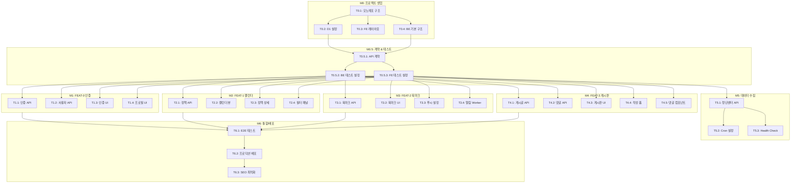

# TASKS: PolicyFlow KR - AI 개발 파트너용 태스크 목록

> 정부 지원금 및 정책 자금 맞춤형 캘린더 서비스 구현 태스크

---

## MVP 캡슐

| # | 항목 | 내용 |
|---|------|------|
| 1 | 목표 | 모든 국민이 자신에게 해당하는 정책 자금을 단 1원도 놓치지 않도록 돕는다 |
| 2 | 페르소나 | 취업준비생 김민수(26세), 소상공인 이영희(45세) |
| 3 | 핵심 기능 | FEAT-1: 정책 캘린더 (맞춤형 정책 시각화) |
| 4 | 성공 지표 (노스스타) | MAU 10,000명 |
| 5 | 입력 지표 | 북마크 정책 수, 푸시 알림 허용률 |
| 6 | 비기능 요구 | 서버 비용 0원 (Cloudflare 무료 티어) |
| 7 | Out-of-scope | 다크모드, 모바일 앱, 정책 신청 대행 |
| 8 | Top 리스크 | 공공 API 변경/중단 시 데이터 수집 불가 |
| 9 | 완화/실험 | Health Check Worker + 사용자 제보 시스템 |
| 10 | 다음 단계 | Cloudflare 계정 세팅 및 D1 데이터베이스 생성 |

---

## 마일스톤 개요

| 마일스톤 | 설명 | 주요 기능 | Phase |
|----------|------|----------|-------|
| M0 | 프로젝트 셋업 | 인프라, 구조, 환경 설정 | Phase 0 |
| M0.5 | 계약 & 테스트 스켈레톤 | API 계약, 테스트 프레임워크 | Phase 0 |
| M1 | FEAT-0 인증/사용자 | 소셜 로그인, 프로필 설정 | Phase 1 |
| M2 | FEAT-1 정책 캘린더 | 정책 조회, 필터링, 캘린더 UI | Phase 2 |
| M3 | FEAT-2 북마크 & 알림 | 북마크 CRUD, 푸시 알림 | Phase 3 |
| M4 | FEAT-3 커뮤니티 게시판 | 게시글, 댓글, 좋아요 | Phase 4 |
| M5 | 데이터 수집 파이프라인 | Cron Trigger, 공공 API 연동 | Phase 5 |
| M6 | 통합 및 배포 | E2E 테스트, 프로덕션 배포 | Phase 6 |

---

## M0: 프로젝트 셋업

### [x] Phase 0, T0.1: 프로젝트 초기화 및 모노레포 구조 생성

**담당**: frontend-specialist

**작업 내용**:
- 루트 `package.json` 생성 (npm workspaces)
- `frontend/` 디렉토리: Next.js 14 프로젝트 초기화
- `backend/` 디렉토리: Cloudflare Workers + Hono 프로젝트 초기화
- `contracts/` 디렉토리: 공유 타입 정의
- 공통 설정: TypeScript, ESLint, Prettier

**산출물**:
- `package.json` (루트)
- `frontend/package.json`
- `backend/package.json`
- `tsconfig.json` (base)
- `.eslintrc.js`, `.prettierrc`
- `.gitignore`

**완료 조건**:
- [ ] `npm install` 성공
- [ ] `npm run lint` 통과
- [ ] `npm run type-check` 통과

---

### [x] Phase 0, T0.2: Cloudflare D1 데이터베이스 설정

**담당**: database-specialist

**작업 내용**:
- `wrangler.toml` 설정 (D1 바인딩)
- Drizzle ORM 설정
- DB 스키마 정의 (`backend/src/db/schema.ts`)
- 마이그레이션 파일 생성

**산출물**:
- `backend/wrangler.toml`
- `backend/src/db/schema.ts`
- `backend/drizzle.config.ts`
- `backend/drizzle/0001_initial.sql`

**완료 조건**:
- [ ] `wrangler d1 execute` 로컬 테스트 성공
- [ ] 모든 테이블 생성 확인
- [ ] 인덱스 생성 확인

---

### [x] Phase 0, T0.3: 프론트엔드 기본 레이아웃 및 라우팅

**담당**: frontend-specialist

**작업 내용**:
- Next.js App Router 구조 설정
- TailwindCSS 설정
- 기본 레이아웃 컴포넌트 (Header, TabBar)
- 페이지 스켈레톤 생성 (/, /community, /mypage)

**산출물**:
- `frontend/src/app/layout.tsx`
- `frontend/src/app/page.tsx`
- `frontend/src/app/community/page.tsx`
- `frontend/src/app/mypage/page.tsx`
- `frontend/src/components/layout/TabBar.tsx`
- `frontend/tailwind.config.js`

**완료 조건**:
- [ ] `npm run dev` 성공
- [ ] 3개 페이지 라우팅 동작
- [ ] 하단 탭 네비게이션 표시

---

### [x] Phase 0, T0.4: 백엔드 Hono 기본 구조 및 미들웨어

**담당**: backend-specialist

**작업 내용**:
- Hono 앱 초기화 (`backend/src/index.ts`)
- CORS 미들웨어 설정
- 에러 핸들링 미들웨어
- Health check 엔드포인트

**산출물**:
- `backend/src/index.ts`
- `backend/src/middleware/cors.ts`
- `backend/src/middleware/error-handler.ts`
- `backend/src/routes/health.ts`

**완료 조건**:
- [ ] `wrangler dev` 성공
- [ ] `GET /health` 응답 확인
- [ ] CORS 헤더 확인

---

## M0.5: 계약 & 테스트 스켈레톤

### [x] Phase 0, T0.5.1: API 계약 정의 (Contracts)

**담당**: backend-specialist

**작업 내용**:
- 공통 타입 정의 (`contracts/types.ts`)
- 인증 API 계약 (`contracts/auth.contract.ts`)
- 정책 API 계약 (`contracts/policies.contract.ts`)
- 북마크 API 계약 (`contracts/bookmarks.contract.ts`)
- 게시판 API 계약 (`contracts/posts.contract.ts`)

**산출물**:
- `contracts/types.ts`
- `contracts/auth.contract.ts`
- `contracts/policies.contract.ts`
- `contracts/bookmarks.contract.ts`
- `contracts/posts.contract.ts`

**완료 조건**:
- [ ] 모든 계약 파일에 요청/응답 타입 정의
- [ ] TypeScript 컴파일 성공
- [ ] BE/FE 양쪽에서 import 가능

---

### [x] Phase 0, T0.5.2: 백엔드 테스트 프레임워크 설정

**담당**: test-specialist

**작업 내용**:
- Vitest 설정
- Miniflare 테스트 환경 설정
- 테스트 유틸리티 (DB 시드, 헬퍼)
- 첫 번째 테스트 파일 (health check)

**산출물**:
- `backend/vitest.config.ts`
- `backend/__tests__/setup.ts`
- `backend/__tests__/utils/test-helpers.ts`
- `backend/__tests__/api/health.test.ts`

**완료 조건**:
- [ ] `npm run test` 성공
- [ ] health check 테스트 통과
- [ ] 커버리지 리포트 생성

---

### [x] Phase 0, T0.5.3: 프론트엔드 테스트 프레임워크 설정

**담당**: test-specialist

**작업 내용**:
- Vitest + React Testing Library 설정
- MSW (Mock Service Worker) 설정
- 테스트 유틸리티
- 첫 번째 컴포넌트 테스트

**산출물**:
- `frontend/vitest.config.ts`
- `frontend/src/mocks/server.ts`
- `frontend/src/mocks/handlers/index.ts`
- `frontend/__tests__/setup.ts`
- `frontend/__tests__/components/TabBar.test.tsx`

**완료 조건**:
- [ ] `npm run test` 성공
- [ ] TabBar 테스트 통과
- [ ] MSW 모킹 동작 확인

---

## M1: FEAT-0 인증/사용자

### [ ] Phase 1, T1.1: 인증 API (소셜 로그인) RED→GREEN

**담당**: backend-specialist

**Git Worktree 설정**:
```bash
# 1. Worktree 생성
git worktree add ../policyflow-phase1-auth -b phase/1-auth
cd ../policyflow-phase1-auth

# 2. 작업 완료 후 병합 (사용자 승인 필요)
# git checkout main
# git merge phase/1-auth
# git worktree remove ../policyflow-phase1-auth
```

**TDD 사이클**:

1. **RED**: 테스트 작성 (실패 확인)
   ```bash
   # 테스트 파일: backend/__tests__/api/auth.test.ts
   cd backend && npm run test -- __tests__/api/auth.test.ts
   # Expected: FAILED
   ```

2. **GREEN**: 최소 구현 (테스트 통과)
   ```bash
   # 구현 파일: backend/src/routes/auth.ts
   cd backend && npm run test -- __tests__/api/auth.test.ts
   # Expected: PASSED
   ```

3. **REFACTOR**: 리팩토링 (테스트 유지)
   - JWT 토큰 생성 로직 분리
   - 에러 처리 개선

**산출물**:
- `backend/__tests__/api/auth.test.ts` (테스트)
- `backend/src/routes/auth.ts` (구현)
- `backend/src/services/auth.service.ts` (서비스)
- `backend/src/schemas/auth.ts` (Zod 스키마)

**인수 조건**:
- [ ] 테스트 먼저 작성됨 (RED 확인)
- [ ] POST /api/v1/auth/login 동작
- [ ] POST /api/v1/auth/refresh 동작
- [ ] DELETE /api/v1/auth/logout 동작
- [ ] 모든 테스트 통과 (GREEN)
- [ ] 커버리지 >= 80%

**완료 시**:
- [ ] 사용자 승인 후 main 브랜치에 병합
- [ ] worktree 정리: `git worktree remove ../policyflow-phase1-auth`

---

### [ ] Phase 1, T1.2: 사용자 API (프로필/설정) RED→GREEN

**담당**: backend-specialist

**Git Worktree 설정**:
```bash
git worktree add ../policyflow-phase1-users -b phase/1-users
cd ../policyflow-phase1-users
```

**TDD 사이클**:

1. **RED**: 테스트 작성
   ```bash
   # 테스트 파일: backend/__tests__/api/users.test.ts
   npm run test -- __tests__/api/users.test.ts  # FAILED
   ```

2. **GREEN**: 구현
   ```bash
   # 구현 파일: backend/src/routes/users.ts
   npm run test -- __tests__/api/users.test.ts  # PASSED
   ```

**산출물**:
- `backend/__tests__/api/users.test.ts`
- `backend/src/routes/users.ts`
- `backend/src/services/users.service.ts`
- `backend/src/schemas/users.ts`

**인수 조건**:
- [ ] GET /api/v1/users/me 동작
- [ ] PUT /api/v1/users/me/preferences 동작
- [ ] POST /api/v1/users/me/push-token 동작
- [ ] 모든 테스트 통과
- [ ] 커버리지 >= 80%

---

### [ ] Phase 1, T1.3: 인증 UI (소셜 로그인 화면) RED→GREEN

**담당**: frontend-specialist

**의존성**: T1.1 (인증 API) - **Mock 사용으로 독립 개발 가능**

**Git Worktree 설정**:
```bash
git worktree add ../policyflow-phase1-auth-fe -b phase/1-auth-fe
cd ../policyflow-phase1-auth-fe
```

**Mock 설정**:
```typescript
// frontend/src/mocks/handlers/auth.ts
import { http, HttpResponse } from 'msw';

export const authHandlers = [
  http.post('/api/v1/auth/login', () => {
    return HttpResponse.json({
      data: { accessToken: 'mock-token', user: { id: '1', nickname: '테스트' } }
    });
  }),
];
```

**TDD 사이클**:

1. **RED**: 테스트 작성
   ```bash
   # 테스트 파일: frontend/__tests__/pages/auth/login.test.tsx
   npm run test -- __tests__/pages/auth/login.test.tsx  # FAILED
   ```

2. **GREEN**: 구현
   ```bash
   npm run test -- __tests__/pages/auth/login.test.tsx  # PASSED
   ```

**산출물**:
- `frontend/__tests__/pages/auth/login.test.tsx`
- `frontend/src/app/auth/login/page.tsx`
- `frontend/src/components/auth/SocialLoginButton.tsx`
- `frontend/src/hooks/useAuth.ts`
- `frontend/src/stores/authStore.ts`

**인수 조건**:
- [ ] 웰컴 화면 렌더링
- [ ] Google 로그인 버튼 동작
- [ ] Kakao 로그인 버튼 동작
- [ ] 로그인 후 메인으로 리다이렉트
- [ ] 모든 테스트 통과

---

### [ ] Phase 1, T1.4: 프로필 설정 UI RED→GREEN

**담당**: frontend-specialist

**의존성**: T1.2 (사용자 API) - **Mock 사용으로 독립 개발 가능**

**Git Worktree 설정**:
```bash
git worktree add ../policyflow-phase1-profile-fe -b phase/1-profile-fe
cd ../policyflow-phase1-profile-fe
```

**산출물**:
- `frontend/__tests__/pages/profile/setup.test.tsx`
- `frontend/src/app/profile/setup/page.tsx`
- `frontend/src/components/profile/AgeSelector.tsx`
- `frontend/src/components/profile/RegionSelector.tsx`
- `frontend/src/components/profile/CategorySelector.tsx`

**인수 조건**:
- [ ] 나이대 선택 UI
- [ ] 거주 지역 선택 UI
- [ ] 관심 분야 선택 UI
- [ ] 설정 저장 후 메인으로 이동
- [ ] 모든 테스트 통과

---

## M2: FEAT-1 정책 캘린더

### [ ] Phase 2, T2.1: 정책 API (목록/상세) RED→GREEN

**담당**: backend-specialist

**Git Worktree 설정**:
```bash
git worktree add ../policyflow-phase2-policies -b phase/2-policies
cd ../policyflow-phase2-policies
```

**TDD 사이클**:

1. **RED**: 테스트 작성
   ```bash
   # 테스트 파일: backend/__tests__/api/policies.test.ts
   npm run test -- __tests__/api/policies.test.ts  # FAILED
   ```

2. **GREEN**: 구현
   ```bash
   npm run test -- __tests__/api/policies.test.ts  # PASSED
   ```

**산출물**:
- `backend/__tests__/api/policies.test.ts`
- `backend/src/routes/policies.ts`
- `backend/src/services/policies.service.ts`
- `backend/src/schemas/policies.ts`

**인수 조건**:
- [ ] GET /api/v1/policies (페이지네이션)
- [ ] GET /api/v1/policies?region=SEOUL (필터링)
- [ ] GET /api/v1/policies?category=JOB (필터링)
- [ ] GET /api/v1/policies/:id (상세)
- [ ] 모든 테스트 통과
- [ ] 커버리지 >= 80%

---

### [ ] Phase 2, T2.2: 캘린더 뷰 컴포넌트 RED→GREEN

**담당**: frontend-specialist

**의존성**: T2.1 (정책 API) - **Mock 사용으로 독립 개발 가능**

**Git Worktree 설정**:
```bash
git worktree add ../policyflow-phase2-calendar-fe -b phase/2-calendar-fe
cd ../policyflow-phase2-calendar-fe
```

**Mock 설정**:
```typescript
// frontend/src/mocks/handlers/policies.ts
export const policiesHandlers = [
  http.get('/api/v1/policies', () => {
    return HttpResponse.json({
      data: [
        { id: '1', title: '청년 월세 지원', start_date: 1704067200, end_date: 1706745600 }
      ],
      meta: { page: 1, total: 100 }
    });
  }),
];
```

**산출물**:
- `frontend/__tests__/components/calendar/CalendarView.test.tsx`
- `frontend/src/components/calendar/CalendarView.tsx`
- `frontend/src/components/calendar/PolicyEventBar.tsx`
- `frontend/src/components/calendar/ListView.tsx`
- `frontend/src/hooks/usePolicies.ts`

**인수 조건**:
- [ ] 월간 캘린더 렌더링
- [ ] 정책 이벤트 바 표시
- [ ] 상태별 색상 코딩 (접수중/마감임박/오픈예정)
- [ ] 캘린더/리스트 뷰 토글
- [ ] 모든 테스트 통과

---

### [ ] Phase 2, T2.3: 정책 상세 모달 RED→GREEN

**담당**: frontend-specialist

**Git Worktree 설정**:
```bash
git worktree add ../policyflow-phase2-detail-fe -b phase/2-detail-fe
cd ../policyflow-phase2-detail-fe
```

**산출물**:
- `frontend/__tests__/components/policy/PolicyDetailModal.test.tsx`
- `frontend/src/components/policy/PolicyDetailModal.tsx`
- `frontend/src/components/ui/Modal.tsx`

**인수 조건**:
- [ ] 정책 상세 정보 표시
- [ ] 신청 기간 강조
- [ ] 신청 페이지 이동 버튼
- [ ] 북마크 토글 버튼 (UI만)
- [ ] 모달 닫기 동작
- [ ] 모든 테스트 통과

---

### [ ] Phase 2, T2.4: 필터 패널 RED→GREEN

**담당**: frontend-specialist

**산출물**:
- `frontend/__tests__/components/filter/FilterPanel.test.tsx`
- `frontend/src/components/filter/FilterPanel.tsx`
- `frontend/src/components/filter/RegionFilter.tsx`
- `frontend/src/components/filter/CategoryFilter.tsx`
- `frontend/src/stores/filterStore.ts`

**인수 조건**:
- [ ] 지역 필터 선택
- [ ] 분야 필터 선택
- [ ] 상태 필터 (접수중/마감임박)
- [ ] 필터 적용 시 캘린더 갱신
- [ ] 모든 테스트 통과

---

## M3: FEAT-2 북마크 & 알림

### [ ] Phase 3, T3.1: 북마크 API RED→GREEN

**담당**: backend-specialist

**Git Worktree 설정**:
```bash
git worktree add ../policyflow-phase3-bookmarks -b phase/3-bookmarks
cd ../policyflow-phase3-bookmarks
```

**산출물**:
- `backend/__tests__/api/bookmarks.test.ts`
- `backend/src/routes/bookmarks.ts`
- `backend/src/services/bookmarks.service.ts`
- `backend/src/schemas/bookmarks.ts`

**인수 조건**:
- [ ] GET /api/v1/bookmarks (내 북마크 목록)
- [ ] POST /api/v1/bookmarks (북마크 추가)
- [ ] DELETE /api/v1/bookmarks/:policyId (북마크 삭제)
- [ ] 인증 필수 검증
- [ ] 모든 테스트 통과

---

### [ ] Phase 3, T3.2: 북마크 UI RED→GREEN

**담당**: frontend-specialist

**의존성**: T3.1 (북마크 API) - **Mock 사용으로 독립 개발 가능**

**산출물**:
- `frontend/__tests__/components/bookmark/BookmarkButton.test.tsx`
- `frontend/__tests__/pages/mypage/bookmarks.test.tsx`
- `frontend/src/components/bookmark/BookmarkButton.tsx`
- `frontend/src/app/mypage/bookmarks/page.tsx`
- `frontend/src/hooks/useBookmarks.ts`

**인수 조건**:
- [ ] 북마크 토글 버튼 동작
- [ ] 북마크 목록 페이지
- [ ] 북마크 삭제 동작
- [ ] 비로그인 시 로그인 유도
- [ ] 모든 테스트 통과

---

### [ ] Phase 3, T3.3: 푸시 알림 설정 RED→GREEN

**담당**: frontend-specialist

**산출물**:
- `frontend/__tests__/hooks/usePushNotification.test.ts`
- `frontend/src/hooks/usePushNotification.ts`
- `frontend/src/lib/firebase.ts`
- `frontend/src/components/notification/PushPermissionModal.tsx`
- `frontend/public/firebase-messaging-sw.js`

**인수 조건**:
- [ ] Firebase 초기화
- [ ] 푸시 권한 요청 모달
- [ ] FCM 토큰 등록
- [ ] 서비스 워커 설정
- [ ] 모든 테스트 통과

---

### [ ] Phase 3, T3.4: 알림 발송 Worker RED→GREEN

**담당**: backend-specialist

**산출물**:
- `backend/__tests__/cron/send-notifications.test.ts`
- `backend/src/cron/send-notifications.ts`
- `backend/src/services/notification.service.ts`

**인수 조건**:
- [ ] 마감 임박 정책 조회
- [ ] 해당 북마크 사용자 조회
- [ ] FCM 푸시 발송
- [ ] Cron Trigger 설정
- [ ] 모든 테스트 통과

---

## M4: FEAT-3 커뮤니티 게시판

### [ ] Phase 4, T4.1: 게시글 API RED→GREEN

**담당**: backend-specialist

**Git Worktree 설정**:
```bash
git worktree add ../policyflow-phase4-posts -b phase/4-posts
cd ../policyflow-phase4-posts
```

**산출물**:
- `backend/__tests__/api/posts.test.ts`
- `backend/src/routes/posts.ts`
- `backend/src/services/posts.service.ts`
- `backend/src/schemas/posts.ts`

**인수 조건**:
- [ ] GET /api/v1/posts (목록, 정책별 필터)
- [ ] POST /api/v1/posts (작성)
- [ ] GET /api/v1/posts/:id (상세)
- [ ] PATCH /api/v1/posts/:id (수정)
- [ ] DELETE /api/v1/posts/:id (삭제)
- [ ] POST /api/v1/posts/:id/like (좋아요)
- [ ] Rate Limiting 적용
- [ ] 모든 테스트 통과

---

### [ ] Phase 4, T4.2: 댓글 API RED→GREEN

**담당**: backend-specialist

**산출물**:
- `backend/__tests__/api/comments.test.ts`
- `backend/src/routes/comments.ts`
- `backend/src/services/comments.service.ts`
- `backend/src/schemas/comments.ts`

**인수 조건**:
- [ ] GET /api/v1/posts/:id/comments (목록)
- [ ] POST /api/v1/posts/:id/comments (작성)
- [ ] DELETE /api/v1/comments/:id (삭제)
- [ ] 대댓글 지원 (1단계)
- [ ] Rate Limiting 적용
- [ ] 모든 테스트 통과

---

### [ ] Phase 4, T4.3: 게시판 UI (목록/상세) RED→GREEN

**담당**: frontend-specialist

**의존성**: T4.1, T4.2 (게시판 API) - **Mock 사용으로 독립 개발 가능**

**산출물**:
- `frontend/__tests__/pages/community/list.test.tsx`
- `frontend/__tests__/pages/community/detail.test.tsx`
- `frontend/src/app/community/page.tsx`
- `frontend/src/app/community/[id]/page.tsx`
- `frontend/src/components/post/PostCard.tsx`
- `frontend/src/components/post/PostTypeTag.tsx`

**인수 조건**:
- [ ] 게시글 목록 표시
- [ ] 게시글 유형 태그 (꿀팁/질문/후기)
- [ ] 게시글 상세 페이지
- [ ] 좋아요 토글
- [ ] 모든 테스트 통과

---

### [ ] Phase 4, T4.4: 게시글 작성 폼 RED→GREEN

**담당**: frontend-specialist

**산출물**:
- `frontend/__tests__/components/post/PostForm.test.tsx`
- `frontend/src/components/post/PostForm.tsx`
- `frontend/src/app/community/write/page.tsx`

**인수 조건**:
- [ ] 유형 선택 UI
- [ ] 닉네임 설정 (익명 옵션)
- [ ] 제목/내용 입력
- [ ] 유효성 검사
- [ ] 게시 후 목록으로 이동
- [ ] 모든 테스트 통과

---

### [ ] Phase 4, T4.5: 댓글 컴포넌트 RED→GREEN

**담당**: frontend-specialist

**산출물**:
- `frontend/__tests__/components/comment/CommentList.test.tsx`
- `frontend/src/components/comment/CommentList.tsx`
- `frontend/src/components/comment/CommentItem.tsx`
- `frontend/src/components/comment/CommentForm.tsx`

**인수 조건**:
- [ ] 댓글 목록 표시
- [ ] 대댓글 표시 (1단계 들여쓰기)
- [ ] 댓글 작성 폼
- [ ] 댓글 삭제
- [ ] 모든 테스트 통과

---

## M5: 데이터 수집 파이프라인

### [ ] Phase 5, T5.1: 청년센터 API 연동 RED→GREEN

**담당**: backend-specialist

**Git Worktree 설정**:
```bash
git worktree add ../policyflow-phase5-ingestion -b phase/5-ingestion
cd ../policyflow-phase5-ingestion
```

**산출물**:
- `backend/__tests__/cron/sync-youth-center.test.ts`
- `backend/src/cron/sync-youth-center.ts`
- `backend/src/services/youth-center-api.service.ts`
- `backend/src/utils/date-parser.ts`

**인수 조건**:
- [ ] 청년센터 API 호출
- [ ] 페이지네이션 처리
- [ ] 날짜 파싱 (정형/비정형)
- [ ] policies 테이블 Upsert
- [ ] sync_status 업데이트
- [ ] 모든 테스트 통과

---

### [ ] Phase 5, T5.2: Cron Trigger 설정

**담당**: backend-specialist

**산출물**:
- `backend/wrangler.toml` (crons 추가)
- `backend/src/index.ts` (scheduled 이벤트 핸들러)

**인수 조건**:
- [ ] 매시 정각 데이터 수집 Cron
- [ ] 매일 오전 9시 알림 발송 Cron
- [ ] Cron 설정 wrangler.toml 반영

---

### [ ] Phase 5, T5.3: Health Check Worker

**담당**: backend-specialist

**산출물**:
- `backend/__tests__/cron/health-check.test.ts`
- `backend/src/cron/health-check.ts`

**인수 조건**:
- [ ] 청년센터 API 상태 체크
- [ ] 연속 실패 시 알림 (Slack/Telegram)
- [ ] 모든 테스트 통과

---

## M6: 통합 및 배포

### [ ] Phase 6, T6.1: E2E 테스트 작성

**담당**: test-specialist

**Git Worktree 설정**:
```bash
git worktree add ../policyflow-phase6-e2e -b phase/6-e2e
cd ../policyflow-phase6-e2e
```

**산출물**:
- `frontend/e2e/auth.spec.ts`
- `frontend/e2e/calendar.spec.ts`
- `frontend/e2e/bookmark.spec.ts`
- `frontend/e2e/community.spec.ts`
- `frontend/playwright.config.ts`

**인수 조건**:
- [ ] 로그인 → 캘린더 → 북마크 플로우
- [ ] 게시글 작성 → 댓글 플로우
- [ ] 모든 E2E 테스트 통과

---

### [ ] Phase 6, T6.2: 프로덕션 배포 설정

**담당**: frontend-specialist

**산출물**:
- `frontend/next.config.js` (Static Export 설정)
- `.github/workflows/deploy.yml` (CI/CD)
- `backend/wrangler.toml` (프로덕션 설정)

**인수 조건**:
- [ ] Frontend: Cloudflare Pages 배포
- [ ] Backend: Cloudflare Workers 배포
- [ ] D1 마이그레이션 프로덕션 적용
- [ ] 환경 변수 설정
- [ ] 배포 성공 확인

---

### [ ] Phase 6, T6.3: SEO 및 메타 태그 최적화

**담당**: frontend-specialist

**산출물**:
- `frontend/src/app/layout.tsx` (메타데이터)
- `frontend/public/robots.txt`
- `frontend/public/sitemap.xml` (또는 동적 생성)

**인수 조건**:
- [ ] Open Graph 태그
- [ ] 페이지별 title/description
- [ ] robots.txt
- [ ] Lighthouse SEO 점수 90+

---

## 의존성 그래프



---

## 병렬 실행 가능 태스크

| Phase | 병렬 실행 가능 태스크 | 설명 |
|-------|---------------------|------|
| Phase 0 | T0.3 + T0.4 | FE 레이아웃, BE 기본 구조 동시 진행 |
| Phase 0 | T0.5.2 + T0.5.3 | BE/FE 테스트 설정 동시 진행 |
| Phase 1 | T1.1 + T1.3 | BE 인증 API, FE 인증 UI (Mock) 동시 진행 |
| Phase 1 | T1.2 + T1.4 | BE 사용자 API, FE 프로필 UI (Mock) 동시 진행 |
| Phase 2 | T2.1 + T2.2 + T2.3 + T2.4 | BE 정책 API, FE 캘린더/상세/필터 (Mock) 동시 진행 |
| Phase 3 | T3.1 + T3.2 + T3.3 | BE 북마크 API, FE 북마크 UI/푸시 (Mock) 동시 진행 |
| Phase 4 | T4.1 + T4.2 + T4.3 + T4.4 + T4.5 | BE 게시글/댓글 API, FE 게시판 UI (Mock) 동시 진행 |
| Phase 5 | T5.1 + T5.3 | 데이터 수집, Health Check 동시 진행 |

---

## 태스크 체크리스트

### Phase 0 (main 브랜치)
- [x] T0.1: 프로젝트 초기화 및 모노레포 구조 생성
- [x] T0.2: Cloudflare D1 데이터베이스 설정
- [x] T0.3: 프론트엔드 기본 레이아웃 및 라우팅
- [x] T0.4: 백엔드 Hono 기본 구조 및 미들웨어
- [x] T0.5.1: API 계약 정의 (Contracts)
- [x] T0.5.2: 백엔드 테스트 프레임워크 설정
- [x] T0.5.3: 프론트엔드 테스트 프레임워크 설정

### Phase 1+ (Git Worktree)
- [ ] T1.1: 인증 API RED→GREEN
- [ ] T1.2: 사용자 API RED→GREEN
- [ ] T1.3: 인증 UI RED→GREEN
- [ ] T1.4: 프로필 설정 UI RED→GREEN
- [ ] T2.1: 정책 API RED→GREEN
- [ ] T2.2: 캘린더 뷰 컴포넌트 RED→GREEN
- [ ] T2.3: 정책 상세 모달 RED→GREEN
- [ ] T2.4: 필터 패널 RED→GREEN
- [ ] T3.1: 북마크 API RED→GREEN
- [ ] T3.2: 북마크 UI RED→GREEN
- [ ] T3.3: 푸시 알림 설정 RED→GREEN
- [ ] T3.4: 알림 발송 Worker RED→GREEN
- [ ] T4.1: 게시글 API RED→GREEN
- [ ] T4.2: 댓글 API RED→GREEN
- [ ] T4.3: 게시판 UI RED→GREEN
- [ ] T4.4: 게시글 작성 폼 RED→GREEN
- [ ] T4.5: 댓글 컴포넌트 RED→GREEN
- [ ] T5.1: 청년센터 API 연동 RED→GREEN
- [ ] T5.2: Cron Trigger 설정
- [ ] T5.3: Health Check Worker
- [ ] T6.1: E2E 테스트 작성
- [ ] T6.2: 프로덕션 배포 설정
- [ ] T6.3: SEO 및 메타 태그 최적화
